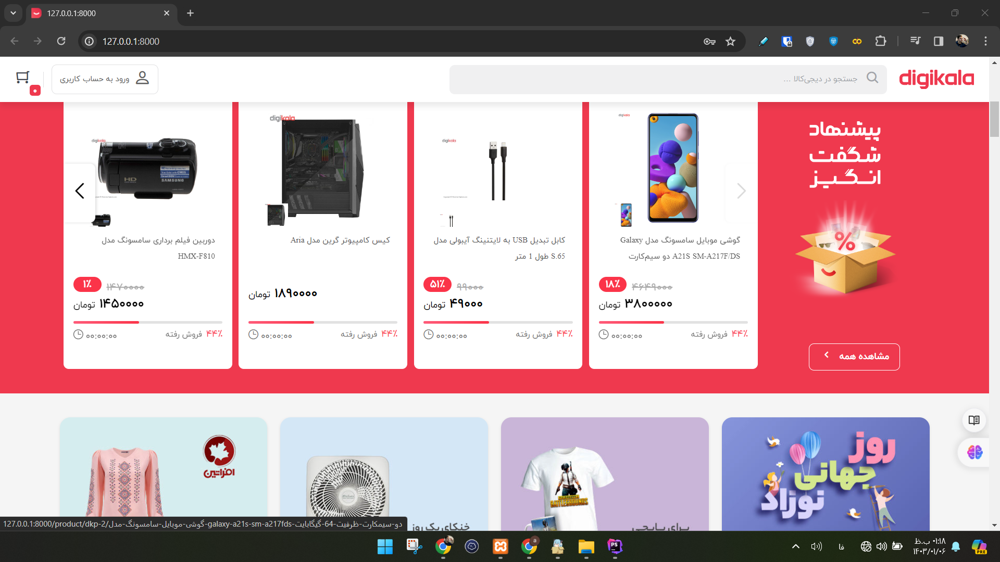

# Laravel Marketplace Demo

[](https://github.com/AlirezaBelal/laravel-marketplace-demo/actions/workflows/ci.yml)



A legacy educational e-commerce / marketplace application built with **Laravel 9**, **Livewire**, Blade, Jetstream/Fortify, and a collection of commerce-oriented integrations.

> **Portfolio status:** this repository is preserved as a bootcamp-era full-stack project and architecture sample. Laravel 9 is end-of-life and no longer receives official security fixes, so this codebase should **not** be treated as production-ready without a framework and dependency upgrade.

This project is an independent educational marketplace implementation. It is **not affiliated with, endorsed by, or operated by Digikala**.

## What the project demonstrates

- customer registration, authentication, profile, address, wishlist, and order flows
- product/category browsing, search-oriented routes, comparisons, comments, and cart/shipping flows
- seller registration and seller-facing routes
- admin routes and dashboard-oriented components
- Livewire-driven interactive UI
- order/payment records and configurable payment drivers
- SMS and email notification integration points
- charts, SEO helpers, file management, and Persian/Jalali date support

## Architecture snapshot

```text
Browser / Livewire UI
        |
        v
Laravel routes + Livewire components + controllers
        |
        +--> Eloquent models / MySQL
        +--> payment gateway abstraction
        +--> SMS / email integrations
        +--> admin and seller workflows
```

The payment callback now verifies the gateway transaction before marking orders as paid. Notification delivery is treated as a side effect after payment state has been committed.

## Safe local setup

Requirements:

- PHP 8.2+
- Composer 2
- Node.js / npm
- MySQL or another database supported by the application schema

```bash
git clone https://github.com/AlirezaBelal/laravel-marketplace-demo.git
cd laravel-marketplace-demo
cp .env.example .env
composer install
php artisan key:generate
npm install
npm run dev
```

Configure your local database in `.env`, then use the Laravel migrations available in `database/migrations` as the source-controlled schema definition:

```bash
php artisan migrate
php artisan serve
```

Raw development database exports are intentionally **not** part of the supported setup. The old `DOC/backup_V06` dumps were removed from the current branch because row-level database exports do not belong in a public repository. If demo records are needed, use synthetic fixtures or create local records manually.

## Payment and notification safety

The tracked `.env.example` uses the package's **local payment driver** by default. Real payment credentials, SMS credentials, mail credentials, and callback secrets must stay outside source control.

Real payment gateways in this legacy project have not been certified for production use. Before deploying a real gateway, upgrade the framework/dependencies, review the selected driver's current API contract, use HTTPS callback URLs, and run an application-specific security review.

## Security posture

The current branch intentionally excludes:

- database dumps (`*.sql`)
- `.env` and local credentials
- vendor/node dependency directories
- runtime logs and generated storage files

The dependency lock is kept on stable releases. CI performs Composer and npm audits. The Composer audit has four explicit advisory exceptions, all scoped to the unsupported Laravel 9 framework line; any additional PHP advisory still fails CI. See [SECURITY.md](SECURITY.md) for the exact advisory IDs and support boundary.

See [SECURITY_REMEDIATION.md](SECURITY_REMEDIATION.md) for the repository cleanup notes.

## Technology

- Laravel 9
- Livewire 2
- Jetstream / Fortify / Sanctum
- Blade, Tailwind, Bootstrap, Alpine.js
- Shetabit Multipay
- Kavenegar integration
- Chart.js and legacy admin UI components

The unsupported CKEditor 5 predefined build and its tracked runtime bundle were removed during the repository security cleanup. Admin text fields retain their native textarea fallback rather than carrying an unmaintained editor dependency.

The unused runtime sitemap endpoint and its crawler/browser dependency chain were also removed rather than retaining unnecessary attack surface in a legacy demo.

## Current limitations

- Laravel 9 is end-of-life and retains documented framework-level advisories with no supported Laravel 9 fix path.
- The codebase originated as a bootcamp project and contains legacy design choices.
- Historical database exports are not part of current setup.
- No production SLA, hosted deployment, or production payment certification is claimed.
- A future modernization should move the application to a supported Laravel release and re-run application-level integration/security testing.

## License

The repository is licensed under the [Apache License 2.0](LICENSE). Third-party packages and assets remain subject to their own licenses and terms.
